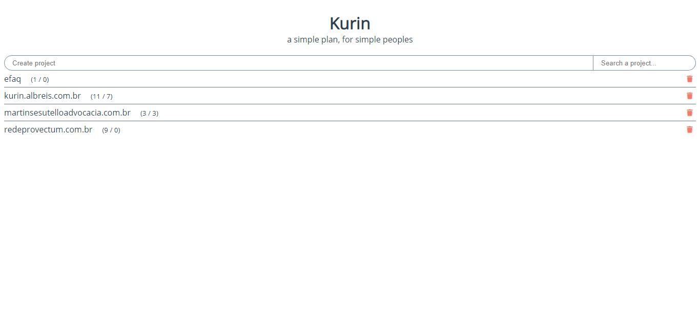
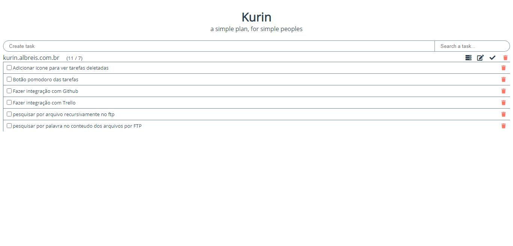
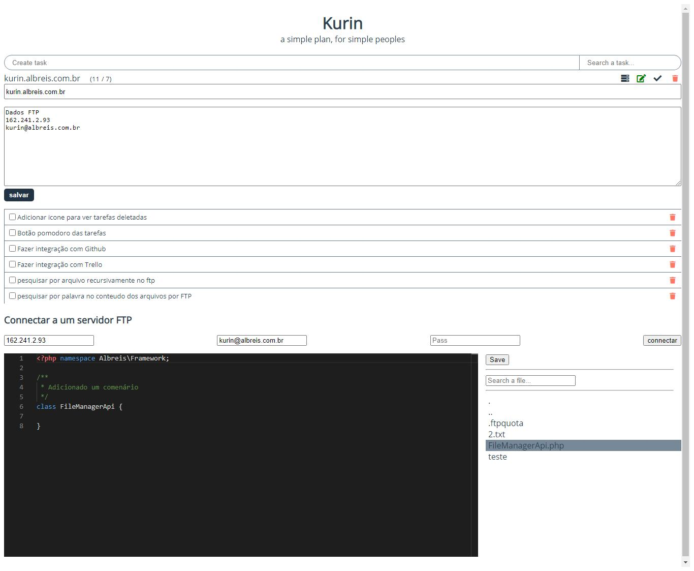

# Kurin


A simple task manager app builded with Electron JS.

Download a pre-build version [here](https://kurin.albreis.com.br/Kurin.exe).

## Project setup
```
npm install
```

### Compiles and hot-reloads for development
```
npm run electron:serve
```

### Compiles and minifies for production
```
npm run electron:build
```

### Customize configuration
See [Configuration Reference](https://cli.vuejs.org/config/).

# Screens

See previews screens

## Login

The login screen is very simples and clean


## Signup

Signup screen shows only if a user don't have a account


## Projects

Project list screen also very simples for better visualization



## Tasks

Tasks screen are show nested in project item



## Project details and tools

Now you can connect to a FTP server for edit files. A very simples implementation, work in progress...



